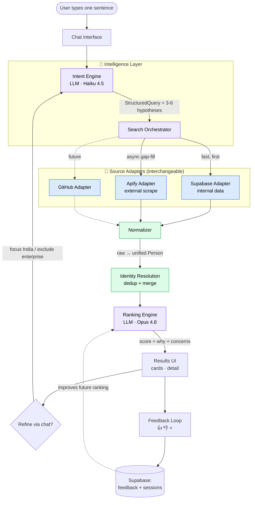
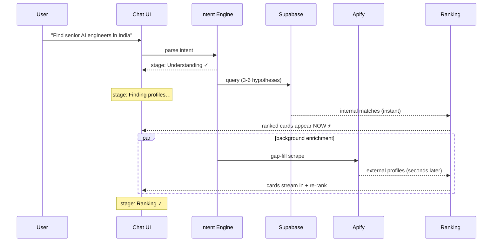
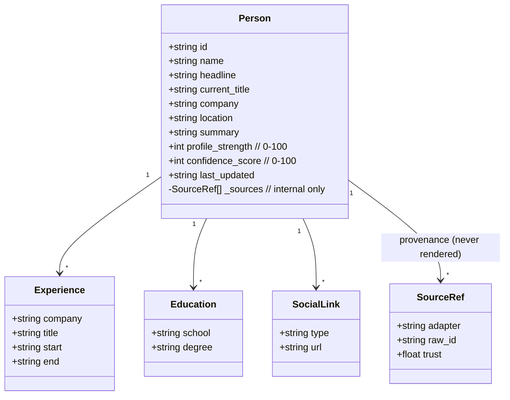
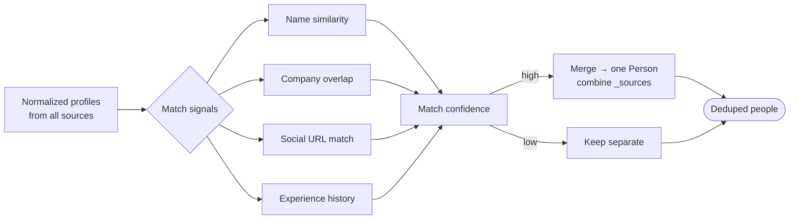
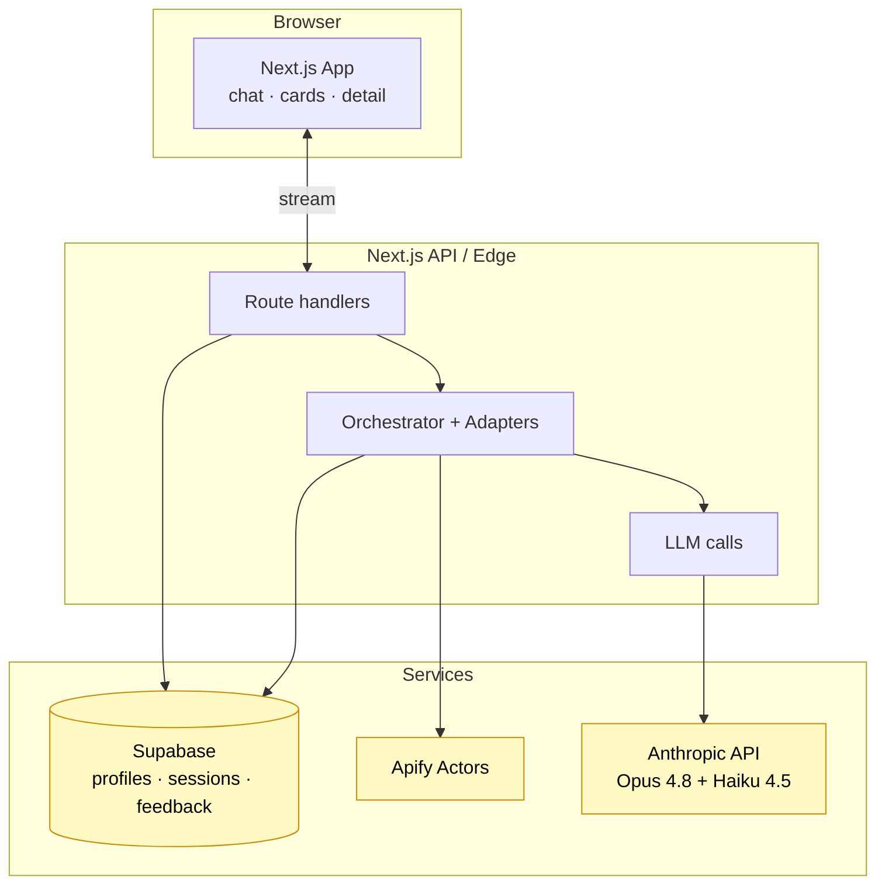

# Third Door — Core Architecture

Visual companion to [SPEC.md](SPEC.md). Diagrams are Mermaid (render in IDE/GitHub, stay editable).

---

## 1. System overview — request to result

**The two boundaries that must not leak:** the `Normalizer` (raw → `Person`) and the
`SourceAdapter` interface. Everything left of the Normalizer knows about sources; everything
right of it only knows `Person`.

---

## 2. The hybrid timing — why it "feels alive"

Internal results render immediately; Apify enrichment streams in and re-ranks live. The user
never waits on a blank screen.

---

## 3. Data layer — unified Person contract

---

## 4. Identity resolution — how duplicates collapse

Tuning the high/low threshold is an early risk: too loose merges different people, too strict
shows visible duplicates.

---

## 5. Deployment / stack view

---

## Legend

| Color | Meaning |
|---|---|
| 🟪 Purple | LLM-powered intelligence (intent, ranking) |
| 🟦 Blue | Source adapters (swappable) |
| 🟩 Green | Core source-agnostic logic (normalize, dedup) |
| 🟨 Yellow | External services |
