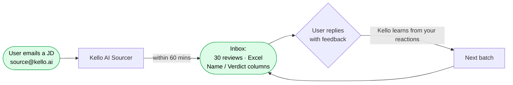
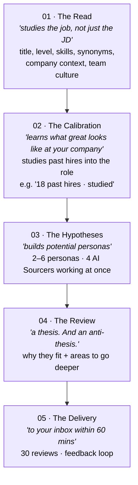
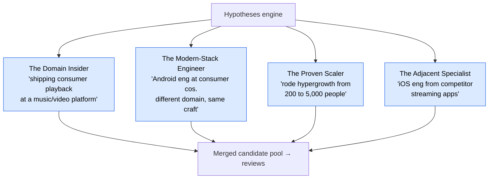
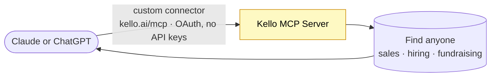
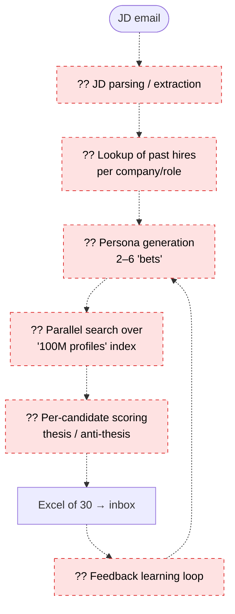

# Kello — Honest Reference Diagram

Built from the **actual scraped content** of [kello.ai](https://kello.ai/#mcp) (scraped 2026-06-22).

> ⚠️ **Honesty note:** Kello's internal architecture is NOT public. Everything in §1–§3 is
> taken verbatim from their marketing site (the user-facing flow, the 5 steps, MCP). §4 is
> clearly labeled **inference** — a reasonable guess at internals, not fact. I have not
> reverse-engineered their actual system.

Source of truth — their own copy:
- _"Its your AI Sourcer that reviews 100M profiles. Scouts 30 candidates worth calling. In 60 mins."_
- _"NO TOOLING. NO TRAINING. FREE TO TRY."_ · _"First 2 jobs are Free."_
- Company: © 2026 XXV Century Private Limited

---

## 1. The user-facing flow (100% from the site)

No dashboard, no setup — the entire product entry point is **email a job description**. Output
is an **Excel file of 30 candidates** with Name/Verdict columns. There is a feedback loop by reply.

---

## 2. The 5-step process (exact wording from the site)

### Step 03 fans out into parallel persona "bets" (their 4 named examples)

Each candidate review carries a **thesis + anti-thesis** (their real example):
> **Arjun · Sr Android · Hotstar · 6.8 yrs**
> _Thesis:_ "Shipped Hotstar's playback rewrite through the IPL season…"
> _Anti-thesis:_ "Has only worked at one consumer-scale company…"

---

## 3. The MCP product (separate from the email flow)

Their real example prompts:
- _"Tell me everything about Rajan Anandan — fun, work, investments. I'm looking to fundraise."_
- _"Who are the eng leaders at CRED? I'm looking to onboard them as customers…"_

So Kello has **two surfaces**: (a) the async email-a-JD sourcing product, and (b) an MCP
"find anyone" connector that lives inside Claude/ChatGPT.

---

## 4. Inferred internals — ⚠️ SPECULATION, not from the site

This is a *plausible* architecture consistent with their claims. **Kello has not published this**;
treat every box as a guess.

Unknowns I deliberately did **not** invent: where the 100M profiles come from, what models they
use, how "calibration on past hires" is implemented, latency/cost, or dedup logic.

---

## 5. Kello vs. Third Door — honest comparison

| Dimension | Kello (observed) | Third Door (planned) |
|---|---|---|
| Input | Email a JD | One-sentence intent in chat |
| Interaction | **Async** — wait ~60 min | **Hybrid real-time** — instant + streaming |
| Output | Excel of 30, by email | Live ranked cards + profile detail |
| Strategy fan-out | 2–6 personas, 4 sourcers | 3–6 hypotheses |
| Per-candidate reasoning | thesis + anti-thesis | match score + why + concerns |
| Feedback | Reply to email | In-app 👍/👎/⭐ |
| Source transparency | Not discussed publicly | **Explicitly hidden** (unified Person) |
| Secondary surface | MCP "find anyone" | (not in MVP) |

The shared DNA is striking: **fan out into personas → search → review with both sides → learn
from feedback.** Third Door's bet is to make that *interactive and instant* rather than batch email.
